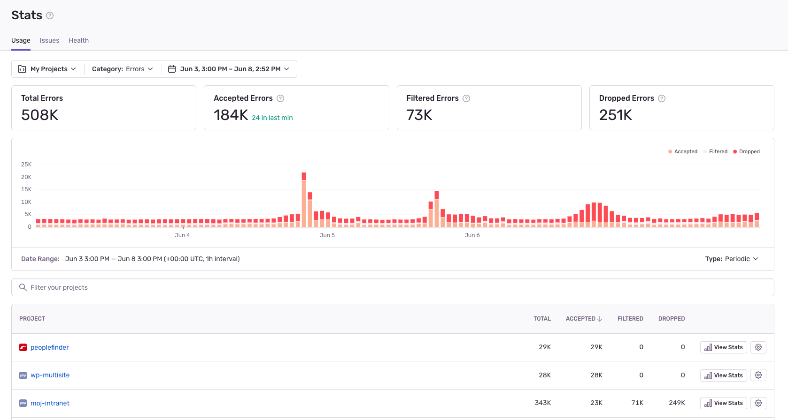

# Responding to Sentry Usage Alert

## Overview

Operations Engineering have
a [Sentry usage alert](https://github.com/ministryofjustice/operations-engineering/actions/workflows/sentry-usage-alert.yml)
which checks whether the Ministry of Justice (MoJ) Sentry quota has
exceeded a quota over a period

> The configuration for the alert is
>
> - Period to check = `1 day`
> - Usage threshold = `60%`

Alerts will be triggered when usage has exceeded the threshold for a given period. The alert will detail some metrics
for context, and a link to the stats in Sentry for further investigation as shown below:

## Investigating Alerts

The first step when investigating these alerts is to click the link provided with the alert.

This link will open Sentry, displaying the quota usage for the alerts time period in graph and table form, as shown
below:

> The link will order the table in order of `Accepted Desc` since these are the events that affect quota usage

Analyse the graph on Sentry, the style of graph will help determine how to react. The style of graph will large fall
into two categories:

- [Intermittent Spikes](#intermittent-spikes)
- [Consistent High Usage](#consistent-high-usage)

### Intermittent Spikes

Intermittent spikes are when for the majority of the time, usage seems normal - though there are abnormally high spikes
in consumption.

These alerts can be ignored if it looks like the cause of the spikes have now subsided. Although this may lead to
further alerts caused by the same project in the future, if the project isn't properly configured to minimise the impact
of spikes.

> The projects spiking will `typically` be at the top of the table.

### Consistent High Usage

Consistent high usage is when the graph in Sentry has a `business as usual` look i.e. normal peaks and troughs that
reflect usage of a typical day.

In this case, consumption of the quota has presumably grown more organically over time. This is excepted as more
teams join Sentry and applications gain more traffic.

> The projects using the most quota will be at the top of the table.

## Remediation

Read through the [Sentry Service Documentation](https://user-guide.operations-engineering.service.justice.gov.uk/documentation/services/sentry) and ensure high usage projects are
following the quota management guidance.

If a project isn't following the guidance, contact the team to understand if there's any particular reason for their
current configuration and assist them in getting quota management controls implemented.

If all high usage projects are following the guidance, raise this with Operations Engineering to discuss whether to:

- Increase the alerting threshold to minimise the number of alerts
- Buy additional Sentry quota to accommodate new additional usage
